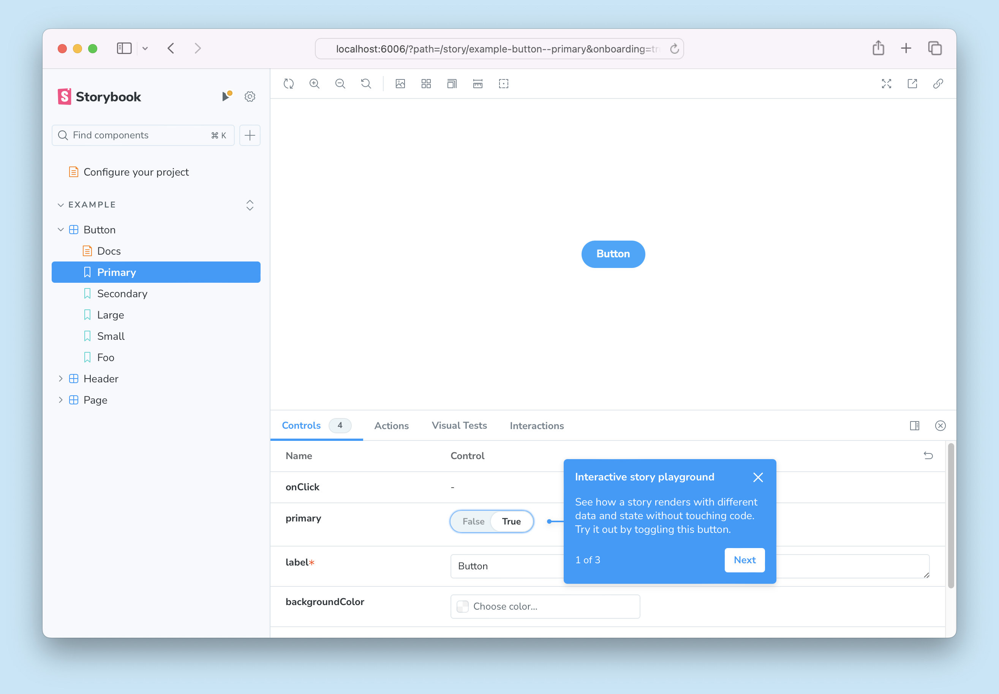

Storybook for React Native Web is a [framework](../../contribute/framework.mdx) that makes it easy to develop and test UI components in isolation for [React Native](https://reactnative.dev/) applications. It uses [Vite](https://vitejs.dev/) to build your components for web browsers. The framework includes:

* ⚛️ React Native components
* 📱 Mobile emulation in the browser
* 🧑‍💻 Shareable on the web
* 🪄 Zero confg
* 💫 and more!

<If notRenderer={'react-native-web'}>
  <Callout variant="info">
    Storybook for React Native Web is only supported in [React Native](?renderer=react-native-web) projects.
  </Callout>

  {/* End non-supported renderers */}
</If>

<If renderer={'react-native-web'}>
  <Callout variant="info">
    In addition to React Native Web, Storybook also supports on-device [React Native](https://github.com/storybookjs/react-native) development. If you're not sure what's right for you, read our [comparison](#react-native-vs-react-native-web).
  </Callout>

  ## Requirements

  * React-Native ≥ 0.72
  * React-Native-Web ≥ 0.19
  * Storybook ≥ 8.5

  ## Getting started

  ### In a project without Storybook

  Follow the prompts after running this command in your React project's root directory:

  {/* prettier-ignore-start */}

  <CodeSnippets path="init-command.md" />

  {/* prettier-ignore-end */}

  [More on getting started with Storybook.](../install.mdx)

  ### In a project with Storybook `addon-react-native-web`

  The [React Native Web addon](https://github.com/storybookjs/addon-react-native-web), `@storybook/addon-react-native-web` was Webpack-based precursor the React Native Web Vite framework `@storybook/react-native-web-vite`.
  
  If you're using the addon, you should migrate  to the framework, which is faster, more stable, maintained, and better documented. You can migrate to the framework by following the steps below.
  
  This framework is designed to work with Storybook 8.5+. If you’re not already using 8.5, upgrade with this command:

  {/* prettier-ignore-start */}

  <CodeSnippets path="storybook-upgrade.md" />

  {/* prettier-ignore-end */}

  Then, install the framework and its peer dependencies:

  {/* prettier-ignore-start */}

  <CodeSnippets path="react-native-web-vite-install.md" />

  {/* prettier-ignore-end */}

  Then, update your `.storybook/main.js|ts` to change the framework property and remove the `@storybook/addon-react-native-web` addon:

  {/* prettier-ignore-start */}

  <CodeSnippets path="react-vite-add-framework.md" />

  {/* prettier-ignore-end */}

  Finally, you can manually remove `@storybook/react-webpack5` and `@storybook/addon-react-native-web` as project dependencies in `package.json`.

  ### In a project with Storybook `react-native`
  
  [Storybook for React Native](https://github.com/storybookjs/react-native) is a framework that runs in a simulator or on your mobile device.
  
  It's possible to run React Native Web alongside React Native, but we are still working on a seamless integration. In the mantime, we recommend running one or the other. If you're not sure what's right for you, read our [comparison](#react-native-vs-react-native-web).

  ## Run the Setup Wizard

  If all goes well, you should see a setup wizard that will help you get started with Storybook introducing you to the main concepts and features, including how the UI is organized, how to write your first story, and how to test your components' response to various inputs utilizing [controls](../../essentials/controls.mdx).

  

  If you skipped the wizard, you can always run it again by adding the `?path=/onboarding` query parameter to the URL of your Storybook instance, provided that the example stories are still available.

  ## API

  ### Options

  You can pass an options object for additional configuration if needed:

  ```ts
  // .storybook/main.ts
  import type { StorybookConfig } from '@storybook/react-native-web-vite';

  const config: StorybookConfig = {
    framework: {
      name: '@storybook/react-native-web-vite',
      options: {
        // ...
      },
    },
  };

  export default config;
  ```

  #### `builder`

  Type: `Record<string, any>`

  Configure options for the [framework's builder](../../api/main-config/main-config-framework.mdx#optionsbuilder). For this framework, available options can be found in the [Vite builder docs](../../builders/vite.mdx).

  ## React Native vs React Native Web

  If you’re building React Native (RN) components, Storybook has two options: Native and Web.

  Both options provide a catalog of your stories that hot refreshes as you edit the code in your favorite editor.

  [Image: native + web]

  However, their implementations are quite different:

  - **Native** runs inside your RN app. It’s high fidelity but has a limited feature set.
  - **Web** displays your RN components in the browser. It’s based on Storybook for Web, which is feature rich and mature.

  So, which option is right for you?

  **Native.** You should choose Native if you want:

  - **Native features.** Your components rely on device-specific features like native modules. Native runs in your actual app, in-simulator or on-device, and provides full fidelity. Web uses `react-native-web`, which works for most components but has [limitations](https://necolas.github.io/react-native-web/docs/react-native-compatibility/).
  - **Mobile publication.** You want to share your Storybook on-device as part of a test build, or embedded inside your application.

  **Web.** You should choose Web if you want:

  - [**Sharing](https://storybook.js.org/docs/sharing).** Publish to the web and share with your team or publicly.
  - [**Documentation](https://storybook.js.org/docs/writing-docs). A**uto-generated component docs or rich markdown docs in MDX.
  - [**Testing**](https://storybook.js.org/docs/writing-tests). Component, visual, and a11y tests for your components.
  - [**Addons**](https://storybook.js.org/docs/essentials). 500+ addons that improve development, documentation, testing, and integration with other tools.

  **Both.** It’s also possible to use both options together. However, this increases Storybook’s install footprint and requires more work to configure. Therefore, we recommend choosing one option to start and then extending it once you have something working.
  {/* End supported renderers */}
</If>

