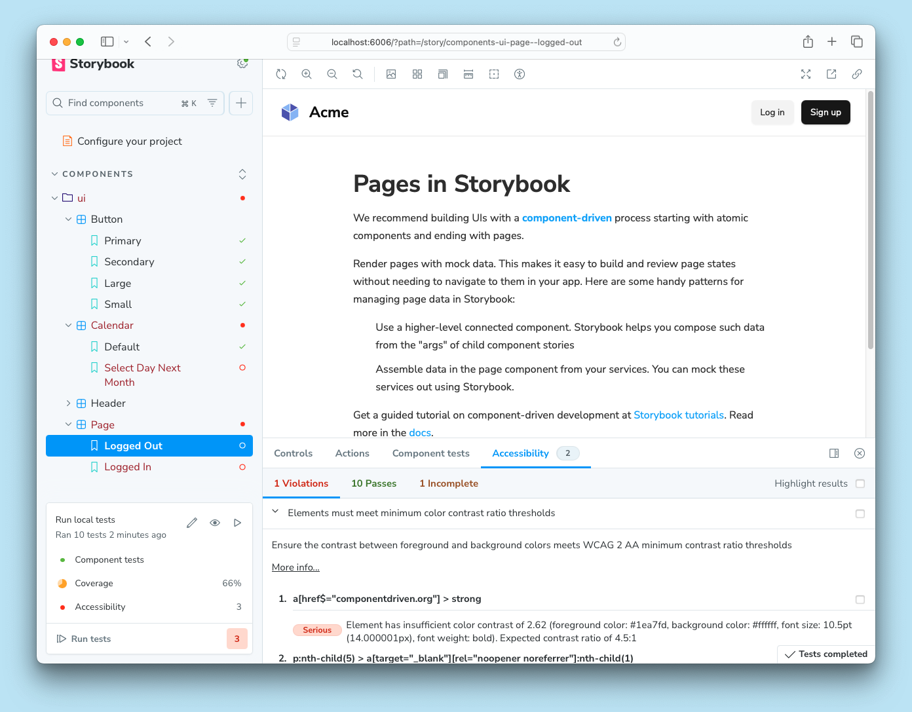

<YouTubeCallout id="rNLL0SICr9w" title="STOP fighting accessibility | automate a11y checks" />

Accessibility is the practice of making websites inclusive to all. That means supporting requirements such as: keyboard navigation, screen reader support, touch-friendly, usable color contrast, reduced motion, and zoom support.

Accessibility tests audit the rendered DOM against a set of heuristics based on [WCAG](https://www.w3.org/WAI/standards-guidelines/wcag/) rules and other industry-accepted best practices. They act as the first line of QA to catch blatant accessibility violations.

<Video src="../_assets/writing-tests/component-accessibility-testing.mp4" />

## Accessibility checks with a11y addon

Storybook provides an official [a11y addon](https://storybook.js.org/addons/@storybook/addon-a11y). Powered by Deque's [axe-core](https://github.com/dequelabs/axe-core), which automatically catches up to [57% of WCAG issues](https://www.deque.com/blog/automated-testing-study-identifies-57-percent-of-digital-accessibility-issues/).

### Set up the a11y addon

If you want to check accessibility for your stories using the [addon](https://storybook.js.org/addons/@storybook/addon-a11y/), you'll need to add it to your Storybook. You can do this by running the following command:

{/* prettier-ignore-start */}

<CodeSnippets path="storybook-a11y-add.md" />

{/* prettier-ignore-end */}

<Callout variant="info">

The CLI's [`add`](../api/cli-options.mdx#add) command automates the addon's installation and setup. To install it manually, see our [documentation](../addons/install-addons.mdx#manual-installation) on how to install addons.

</Callout>

Start your Storybook, and you will see some noticeable differences in the UI. A new toolbar icon and the accessibility panel where you can inspect the results of the tests.


### How it works

Storybook's a11y addon runs [Axe](https://github.com/dequelabs/axe-core) on the selected story. Allowing you to catch and fix accessibility issues during development. For example, if you’re working on a button component and included the following set of stories:

{/* prettier-ignore-start */}

<CodeSnippets path="component-story-with-accessibility.md" />

{/* prettier-ignore-end */}

Cycling through both stories, you will see that the `Inaccessible` story contains some issues that need fixing. Opening the violations tab in the accessibility panel provides a clear description of the accessibility issue and guidelines for solving it.


### Configure

Out of the box, Storybook's accessibility addon includes a set of accessibility rules that cover most issues. You can also fine-tune the [addon configuration](https://github.com/storybookjs/storybook/tree/next/code/addons/a11y#parameters) or override [Axe's ruleset](https://github.com/storybookjs/storybook/tree/next/code/addons/a11y#handling-failing-rules) to best suit your needs.

#### Global a11y configuration

If you need to dismiss an accessibility rule or modify its settings across all stories, you can add the following to your [`storybook/preview.js|ts`](../configure/index.mdx#configure-story-rendering):

{/* prettier-ignore-start */}

<CodeSnippets path="storybook-addon-a11y-global-config.md" />

{/* prettier-ignore-end */}

#### Component-level a11y configuration

<If renderer="svelte">

  You can also customize your own set of rules for all stories of a component. If you're using Svelte CSF with the native templating syntax, you can update the `defineMeta` function. If you're using regular CSF, you can update the default export of the story file.

</If>

<If notRenderer={['svelte']}>

  You can also customize your own set of rules for all stories of a component. Update the story file's default export and add parameters and globals with the required configuration:

</If>

{/* prettier-ignore-start */}

<CodeSnippets path="storybook-addon-a11y-component-config.md" />

{/* prettier-ignore-end */}

#### Story-level a11y configuration

Customize the a11y ruleset at the story level by updating your story to include a new parameter:

{/* prettier-ignore-start */}

<CodeSnippets path="storybook-addon-a11y-story-config.md" />

{/* prettier-ignore-end */}

#### Turn off automated a11y tests

<If renderer="svelte">

  If you are using Svelte CSF, you can turn off automated accessibility testing for stories or components by adding globals to your story or adjusting the `defineMeta` function with the required configuration. With a regular CSF story, you can add the following to your story's export or component's default export:
  
</If>

<If notRenderer={['svelte']}>

  Disable automated accessibility testing for stories or components by adding the following globals to your story’s export or component’s default export:

</If>


{/* prettier-ignore-start */}

<CodeSnippets path="storybook-addon-a11y-disable.md" />

{/* prettier-ignore-end */}

<If renderer={['react', 'vue', 'svelte']}>

## Test addon integration

The accessibility addon provides seamless integration with the [Test addon](./test-addon.mdx), enabling you to run automated accessibility checks for all your tests in the background while you run component tests. If there are any violations, the test will fail, and you will see the results in the sidebar without any additional setup.



### Manual upgrade

If you enabled the addon and you're manually upgrading to Storybook 8.5 or later, you'll need to adjust your existing configuration (i.e., `.storybook/vitest.setup.ts`) to enable the integration as follows:

<CodeSnippets path="storybook-addon-a11y-test-setup.md" />

### Configure accessibility tests with the test addon

Like the Test addon, the accessibility addon also supports [tags](../writing-stories/tags.mdx) to filter the tests you want to run. By default, the addon applies the `a11ytest` tag to all stories. If you need to exclude a story from being accessibility tested, you can remove that tag by applying the `!a11ytest` tag to the story. This also works at the project (in `.storybook/preview.js|ts`) or component level (default export in the story file).

You can use tags to progressively work toward a more accessible UI by enabling accessibility tests for a subset of stories and gradually increasing the coverage. For example, a typical workflow might look like this:

1. Run accessibility tests for your entire project.
1. Find that many stories have accessibility issues (and maybe feel a bit overwhelmed!).
1. Temporarily exclude all stories from accessibility tests.

   ```ts title=".storybook/preview.ts"
   // Replace your-renderer with the renderer you are using (e.g., react, vue3)
   import { Preview } from '@storybook/your-renderer';
   
   const preview: Preview = {
     // ...
     // 👇 Temporarily remove the a11ytest tag from all stories
     tags: ['!a11ytest'],
   };
  
   export default preview;
   ```

1. Pick a good starting point (we recommend something like Button, for its simplicity and likelihood of being used within other components) and re-include it in the accessibility tests.

   {/* prettier-ignore-start */}

   <CodeSnippets path="addon-a11y-meta-tag.md" />

   {/* prettier-ignore-end */}

1. Pick another component and repeat the process until you've covered all your components and you're an accessibility hero!

### Override accessibility violation levels

By default, when the accessibility addon runs with the test addon enabled, it interprets all violations as errors. This means that if a story has a minor accessibility violation, the test will fail. However, you can override this behavior by setting the `warnings` parameter in the `a11y` configuration object to define an array of impact levels that should be considered warnings.

{/* prettier-ignore-start */}

<CodeSnippets path="storybook-addon-a11y-test-override-warning-levels.md" />

{/* prettier-ignore-end */}

In the example above, we configured all the `minor` or `moderate` accessibility violations to be considered warnings. All other levels (i.e., `serious` or `critical`) will continue to be considered errors, fail the test, and report the results accordingly in the Storybook UI or CLI output.

</If>

## Automate accessibility tests with test runner

The most accurate way to check accessibility is manually on real devices. However, you can use automated tools to catch common accessibility issues. For example, [Axe](https://www.deque.com/axe/), on average, catches upwards to [57% of WCAG issues](https://www.deque.com/blog/automated-testing-study-identifies-57-percent-of-digital-accessibility-issues/) automatically.

These tools work by auditing the rendered DOM against heuristics based on [WCAG](https://www.w3.org/WAI/standards-guidelines/wcag/) rules and other industry-accepted best practices. You can then integrate these tools into your test automation pipeline using the Storybook [test runner](./test-runner.mdx#test-hook-api) and [axe-playwright](https://github.com/abhinaba-ghosh/axe-playwright).

### Setup

To enable accessibility testing with the test runner, you will need to take additional steps to set it up properly. We recommend you go through the [test runner documentation](./test-runner.mdx) before proceeding with the rest of the required configuration.

Run the following command to install the required dependencies.

{/* prettier-ignore-start */}

<CodeSnippets path="test-runner-axe-playwright.md" />

{/* prettier-ignore-end */}

Add a new [configuration file](./test-runner.mdx#test-hook-api) inside your Storybook directory with the following inside:

{/* prettier-ignore-start */}

<CodeSnippets path="test-runner-a11y-config.md" />

{/* prettier-ignore-end */}

<Callout variant="info" icon="💡">
  `preVisit` and `postVisit` are convenient hooks that allow you to extend the test runner's default configuration. Read more about them [here](./test-runner.mdx#test-hook-api).
</Callout>

When you execute the test runner (for example, with `yarn test-storybook`), it will run the accessibility audit and any [component tests](./component-testing.mdx) you might have configured for each component story.

It starts checking for issues by traversing the DOM tree starting from the story's root element and generates a detailed report based on the issues it encountered.


### A11y config with the test runner

The test runner provides [helper methods](./test-runner.mdx#helpers), allowing access to the story's information. You can use them to extend the test runner's configuration and provide additional options you may have for a specific story. For example:

{/* prettier-ignore-start */}

<CodeSnippets path="test-runner-a11y-configure.md" />

{/* prettier-ignore-end */}

### Disable a11y tests with the test runner

Additionally, if you have already [disabled accessibility](#turn-off-automated-a11y-tests) tests for any particular story, you can also configure the test runner to avoid testing it as well. For example:

{/* prettier-ignore-start */}

<CodeSnippets path="test-runner-a11y-disable.md" />

{/* prettier-ignore-end */}

***

#### What’s the difference between browser-based and linter-based accessibility tests?

Browser-based accessibility tests, like those found in Storybook, evaluate the rendered DOM because that gives you the highest accuracy. Auditing code that hasn't been compiled yet is one step removed from the real thing, so you won't catch everything the user might experience.

<If renderer={['react', 'vue', 'svelte']}>

## Troubleshooting

### Why are my tests failing in different environments?

If you enabled the experimental test addon (i.e.,`@storybook/experimental-addon-test`), your tests run in Vitest using your project's configuration with Playwright's Chromium browser. This can lead to inconsistent test results reported in the Storybook UI or CLI. The inconsistency can be due to `axe-core` reporting different results in different environments, such as browser versions or configurations. If you encounter this issue, we recommend reaching out using the default communication channels (e.g., [GitHub discussions](https://github.com/storybookjs/storybook/discussions/new?category=help), [Github issues](https://github.com/storybookjs/storybook/issues/new?template=bug_report.yml)).

</If>

**Learn about other UI tests**

* [Component tests](./component-testing.mdx) for user behavior simulation
* [Visual tests](./visual-testing.mdx) for appearance
* Accessibility tests for accessibility
* [Snapshot tests](./snapshot-testing/snapshot-testing.mdx) for rendering errors and warnings
* [Test runner](./test-runner.mdx) to automate test execution
* [Test coverage](./test-coverage.mdx) for measuring code coverage
* [End-to-end tests](./import-stories-in-tests/stories-in-end-to-end-tests.mdx) for simulating real user scenarios
* [Unit tests](./import-stories-in-tests/stories-in-unit-tests.mdx) for functionality