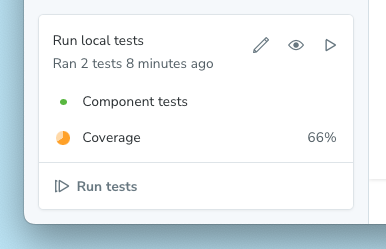
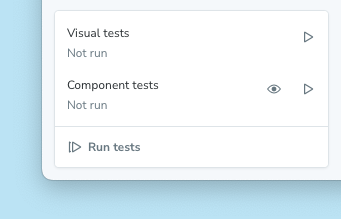
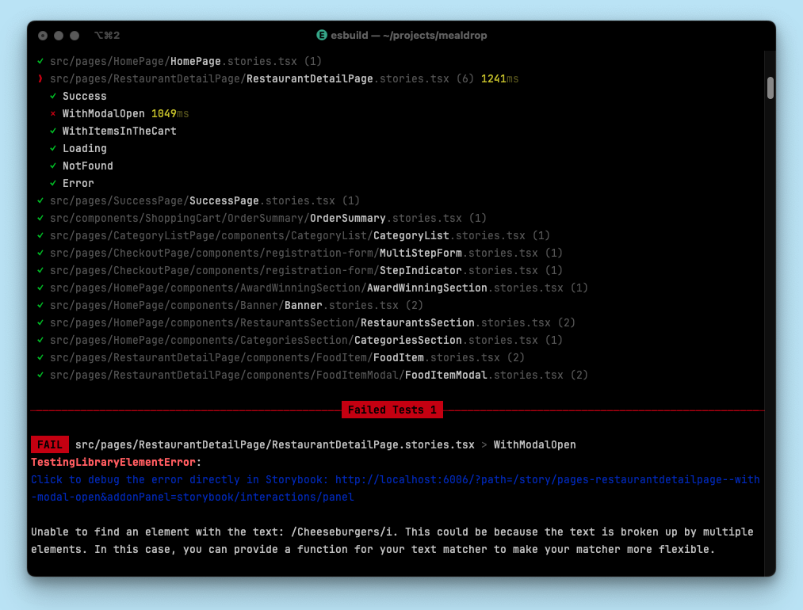
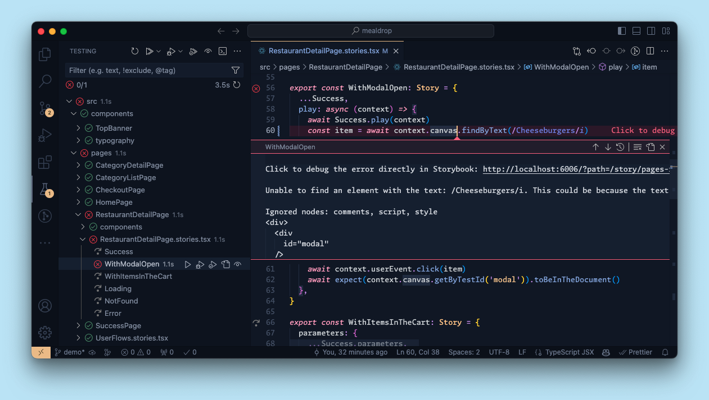

<If notRenderer={['react', 'vue', 'svelte']}>
  <Callout variant="info">
    The Test addon, powered by [Vitest](https://vitest.dev/), is currently only supported in [React](?renderer=react), [Vue](?renderer=vue) and [Svelte](?renderer=svelte) projects, which use the [Vite builder](../builders/vite.mdx) (or the [Next.js framework](../get-started/frameworks/nextjs.mdx)).

    If you are using a different renderer, you can use the [Storyboook test runner](./test-runner.mdx) to test your stories. 
  </Callout>

  {/* End non-supported renderers */}
</If>

<If renderer={['react', 'vue', 'svelte']}>

(⚠️ **Experimental**)

<Callout variant="warning" icon="🧪">
  While this addon is experimental, it is published as the `@storybook/experimental-addon-test` package and the API may change in future releases. We welcome feedback and contributions to help improve this feature.
</Callout>

Storybook's Test addon allows you to test your components directly inside Storybook. It does this by using a Vitest plugin to transform your [stories](../writing-stories/index.mdx) into [Vitest](https://vitest.dev) tests using [portable stories](../api/portable-stories/portable-stories-vitest.mdx).

Stories are tested in two ways: a smoke test to ensure it renders and, if a [play function](../writing-tests/component-testing#write-a-component-test) is defined, that function is run and any [assertions made](../writing-tests/component-testing.mdx#assert-tests-with-vitests-apis) within it are validated.

If a test fails, it will be marked as such in the sidebar and you can click on the story to see the failure. You can also run tests in watch mode, which will automatically re-run tests when you make changes to your components or stories.

<Video src="../_assets/writing-tests/addon-test-overview.mp4" />

## Install and set up

Before installing, make sure your project meets the following requirements:

- Storybook ≥ 8.4
- A Storybook framework that uses Vite (e.g. [`vue3-vite`](../get-started/frameworks/vue3-vite.mdx), [`react-vite`](../get-started/frameworks/react-vite.mdx), etc.), or the [Storybook Next.js framework](../get-started/frameworks/nextjs.mdx)
- Vitest ≥ 2.1
    - If you're not using Vitest, it will be installed and configured for you when you install the addon
- For Next.js projects
    - Next.js ≥ 14.1
    - Must be using the [`@storybook/experimental-nextjs-vite` framework](../get-started/frameworks/nextjs.mdx#with-vite)

If you're not yet using Storybook 8.4, you can [upgrade your Storybook](../configure/upgrading.mdx) to the prerelease version:

<CodeSnippets path="storybook-upgrade-prerelease.md" />

### Automatic setup

Run the following command to install and configure the addon, which contains the plugin to run your stories as tests using Vitest:

<CodeSnippets path="addon-test-install.md" />

That [`add` command](../addons/install-addons.mdx#automatic-installation) will install and register the test addon. It will also inspect your project's Vite and Vitest setup, and install and configure them with sensible defaults, if necessary. You may need to adjust the configuration to fit your project's needs. The full configuration options can be found in the [API section](#options), below.

### Manual setup

For some project setups, the `add` command may be unable to automate the addon and plugin setup and ask you to complete additional setup steps. Here's what to do:

1. Make sure Vite and Vitest are configured in your project.
1. Configure Vitest to use [browser mode](https://vitest.dev/guide/browser/).
1. Install the addon, `@storybook/experimental-addon-test`, in your project and [register it in your Storybook configuration](http://storybook.js.org/docs/addons/install-addons#manual-installation).
1. Create a test setup file, `.storybook/vitest.setup.ts`. You can use the [example setup file](#example-vitest-setup) as a guide.
1. Adjust your Vitest configuration to include the plugin(s) and reference the setup file. You can use the [example configuration files](#example-configuration-files) as a guide.

#### Framework plugins

Some Storybook frameworks require additional setup to enable the framework's features to work with Vitest. Each of those frameworks exports a Vite plugin that you can use to configure your project correctly:

<If renderer="react">
  If you're using Next.js, first install the `@storybook/experimental-nextjs-vite` package:

  {/* prettier-ignore-start */}

  <CodeSnippets path="nextjs-vite-install.md" />

  {/* prettier-ignore-end */}
  
  Then apply the plugin from `@storybook/experimental-nextjs-vite/vite-plugin`:

  ```js title="vitest.config.ts"
  import { defineConfig, mergeConfig } from 'vitest/config';
  import { storybookTest } from '@storybook/experimental-addon-test/vitest-plugin';
  import { storybookNextJsPlugin } from '@storybook/experimental-nextjs-vite/vite-plugin';

  import viteConfig from './vite.config';

  export default mergeConfig(
    viteConfig,
    defineConfig({
      plugins: [
        storybookTest(),
        storybookNextJsPlugin(), // 👈 Apply the framework plugin here
      ],
      // ...
    })
  );
  ```
</If>

<If renderer="vue">
  Vue projects should apply the plugin from `@storybook/vue3-vite/vite-plugin`:

  ```js title="vitest.config.ts"
  import { defineConfig, mergeConfig } from 'vitest/config';
  import { storybookTest } from '@storybook/experimental-addon-test/vitest-plugin';
  import { storybookVuePlugin } from '@storybook/vue3-vite/vite-plugin';

  import viteConfig from './vite.config'

  export default mergeConfig(
    viteConfig,
    defineConfig({
      plugins: [
        storybookTest(),
        storybookVuePlugin(), // 👈 Apply the framework plugin here
      ],
      // ...
    })
  );
  ```
</If>

<If renderer="svelte">
  If you're using SvelteKit, apply the plugin from `@storybook/sveltekit/vite-plugin`:

  ```js title="vitest.config.ts"
  import { defineConfig, mergeConfig } from 'vitest/config';
  import { storybookTest } from '@storybook/experimental-addon-test/vitest-plugin';
  import { storybookSveltekitPlugin } from '@storybook/sveltekit/vite-plugin';

  import viteConfig from './vite.config';

  export default mergeConfig(
    viteConfig,
    defineConfig({
      plugins: [
        storybookTest(),
        storybookSveltekitPlugin(), // 👈 Apply the framework plugin here
      ],
      // ...
    })
  );
  ```
</If>

The above example uses the framework's plugin in a Vitest configuration file. You can also use it in a Vitest workspace file, if that is how your project is configured.

### Example configuration files

When the addon is set up automatically, it will create or adjust your Vitest configuration files for you. If you're setting up manually, you can use the following examples as a reference when configuring your project.

<details id="example-vitest-setup">
  <summary>Example Vitest setup file</summary>

 Storybook stories contain configuration defined in `.storybook/preview.js|ts`. To ensure that configuration is available to your tests, you can apply it in a Vitest setup file. Here's an example of how to do that:

  {/* prettier-ignore-start */}

  <CodeSnippets path="portable-stories-vitest-set-project-annotations-simple.md" />

  {/* prettier-ignore-end */}

  The `setProjectAnnotations` function is part of the [portable stories API](../api/portable-stories/portable-stories-vitest.mdx#setprojectannotations), which is used internally by the Vitest plugin to transform your stories into tests.
</details>

<details id="example-vitest-config">
  <summary>Example Vitest config file</summary>

  The most simple application of the plugin is to include it in your Vitest configuration file:

  {/* prettier-ignore-start */}

  <CodeSnippets path="vitest-plugin-vitest-config.md" />

  {/* prettier-ignore-end */}

</details>

<details id="example-vitest-workspace">
  <summary>Example Vitest workspace file</summary>

  If you're using a [Vitest workspace](https://vitest.dev/guide/workspace), you can define a new workspace project:

  {/* prettier-ignore-start */}

  <CodeSnippets path="vitest-plugin-vitest-workspace.md" />

  {/* prettier-ignore-end */}

</details>

## Usage

There are multiple ways to run tests using the addon:

### Storybook UI

The easiest way to run tests is through the Storybook UI. To run all tests for your components, press the Run tests button in the test module at the bottom of the sidebar.

<Video src="../_assets/writing-tests/addon-test-run-all-tests.mp4" />

Alternatively, you can expand the test module to run specific types of tests individually. For those test types which have a watch mode (which will automatically re-run relevant tests upon code changes), you can toggle that on or off.



<Callout variant="info" icon="ℹ️">

If you have the [Visual tests addon](./visual-testing.mdx) installed, you'll see an option to run Visual tests alongside [Component tests](./component-testing.mdx).



{/* TODO: Add this when a11y support ships */}
{/* Other addons, such as [a11y](./accessibility-testing), may also provide test types that can be run from the test module and affect the status indicators on stories and components. */}

</Callout>

After running your tests, you will now see status indicators on stories and components for their pass, fail, or error state. You can press on these indicators to see more details and jump straight to the failure in the Component tests addon panel. That panel provides an interactive debugger for your component test, allowing you to step through each simulated behavior or assertion.

<Callout variant="info" icon="ℹ️">

The Component tests addon panel replaces the [Interactions addon panel](../essentials/interactions.mdx) when the Test addon is installed. While the testing mechanism is different, the functionality of the addon panel itself remains the same.

</Callout>

The test module will also show you the total number of tests run, the number of tests that passed, and the number of tests that failed or errored. You can press the failure number to filter the sidebar to only those stories that failed.

<Video src="../_assets/writing-tests/addon-test-filter-sidebar.mp4" />

### CLI

The plugin transforms your stories into real Vitest tests, so you run those tests just like you run any other Vitest tests in your project. Typically, you will have a `test` script in your `package.json` that runs your tests.

If you don't already have a `test` script, you can add one that runs Vitest:

```json title="package.json"
{
  "scripts": {
    "test": "vitest"
  }
}
```

If you already have a `test` script that runs something other than Vitest, you can either adjust it to run Vitest (as above) or add a new script that runs Vitest:

```json title="package.json"
{
  "scripts": {
    "test-storybook": "vitest"
  }
}
```

When you run that script, the plugin will find and run your story-based tests alongside any other Vitest tests. Here's an example of running your tests (in [watch mode](https://vitest.dev/guide/cli.html#vitest-watch), by default) using the Vitest CLI:

<CodeSnippets path="vitest-plugin-run-tests.md" />

We recommend (and configure, by default) running Vitest in [browser mode](https://vitest.dev/guide/browser/), using [Playwright's](https://playwright.dev) Chromium browser. Browser mode ensures your components are tested in a real browser environment, which is more accurate than simulations like JSDom or HappyDom. This is especially important for testing components that rely on browser APIs or features.

#### Debugging

While the plugin does not require Storybook to run when testing, you may still want to run Storybook to debug your tests. To enable this, provide the [`storybookScript` option](#storybookscript) in the plugin configuration. When you run Vitest in watch mode, the plugin will start Storybook using this script and provide links to the story in the output on test failures. This allows you to quickly jump to the story in Storybook to debug the issue.

You can also provide a [`storybookUrl` option](#storybookurl) to the plugin configuration. When you're not using watch mode and tests fail, the plugin will provide a link to the story using this URL in the output. This is useful when [running tests in CI](#in-ci) or other environments where Storybook is not already running.



### Editor extension

Transforming your stories into Vitest tests with the plugin also enables you to run and debug tests using Vitest [IDE integrations](https://vitest.dev/guide/ide.html). This allows you to run tests directly from your editor, such as VSCode and JetBrains IDE.

This screenshot shows how you can run your Vitest tests in VSCode using the [Vitest extension](https://marketplace.visualstudio.com/items?itemName=vitest.explorer). Stories are annotated with the test status, and, when a test fails, a link to the story is provided for [debugging](#debugging).



### In CI

For the most part, running your Storybook tests in CI is done [via the CLI](#cli). However, to have the test output link to your published Storybook on test failures, you need to provide the [`storybookUrl` option](#storybookurl) in the plugin configuration.

Here's an example using GitHub Actions. The steps are similar for other CI providers, though details in the syntax or configuration may vary.

When actions for services like Vercel, Netlify and others run a deployment job, they follow a pattern of emitting a `deployment_status` event containing the newly generated URL under `deployment_status.target_url`. This is the URL to the published Storybook instance. We then pass that URL to the plugin configuration using an environment variable, `SB_URL`. Finally, we update the plugin configuration to use that environment variable in the `storybookUrl` option.

```yaml title=".github/workflows/test-storybook.yml"
name: Storybook Tests
on: deployment_status
jobs:
  test:
    timeout-minutes: 60
    runs-on: ubuntu-latest
    if: github.event.deployment_status.state == 'success'
    steps:
      - uses: actions/checkout@v4
      - uses: actions/setup-node@v4
        with:
          node-version: '18.x'
      - name: Install dependencies
        run: yarn
      - name: Run Storybook tests
        run: yarn test-storybook
        env:
          SB_URL: '${{ github.event.deployment_status.target_url }}'
```

```js title="vitest.workspace.ts"
export default defineWorkspace([
  // ...
  {
    // ...
    {
      plugins: [
        storybookTest({
          storybookScript: 'yarn storybook --ci',
          storybookUrl: process.env.SB_URL
        }),
      ],
    },
  },
])
```

## Configuring tests

Most of the configuration for the Vitest plugin's behavior is done in the Vitest configuration and setup files. However, you can also define configuration in your stories themselves, using [tags](../writing-stories/tags.mdx), to control how they are tested.

By default, the plugin will run all stories with the `test` tag. You can adjust this behavior by providing the [`tags` option](#tags) in the plugin configuration. This allows you to include, exclude, or skip stories based on their tags.

In this example, we'll apply the `stable` tag to all of the Button component's stories, except for ExperimentalFeatureStory, which will have the `experimental` tag:

{/* prettier-ignore-start */}

<CodeSnippets path="tags-remove-in-story.md" />

{/* prettier-ignore-end */}

To connect those tags to our test behavior, we can adjust the plugin configuration to exclude the `experimental` tag:

```js title="vitest.workspace.ts"
export default defineWorkspace([
  // ...
  {
    // ...
    {
      plugins: [
        storybookTest({
          // ...
          tags: {
            include: ['test'],
            exclude: ['experimental'],
          },
        }),
      ],
    },
  },
])
```

If the same tag is in both the `include` and `exclude` arrays, the `exclude` behavior takes precedence.

## Comparison to the test runner

The [test runner](./test-runner.mdx) requires a running Storybook instance to test your stories, because it visits each one, executes the play function, and listens for results. The Vitest plugin, however, transforms your stories into tests using Vite and portable stories, so it does not need to run Storybook to test your stories. Because of this reliance on Vite, the plugin can only be used with Storybook frameworks that use Vite (and [Next.js](../get-started/frameworks/nextjs.mdx#with-vite)). The test runner, on the other hand, can be used with any Storybook framework.

The test runner is only a CLI tool. It did not have a UI for running tests, nor did it have an editor extension. The addon, however, provides a UI in Storybook for running tests, and it enables you to run and debug tests using Vitest IDE integrations.

Additionally, the test runner ran your stories as orchestrated tests in Jest, and that orchestration came with some complexity. By comparison, this plugin transforms your stories into real tests and then runs them using Vitest, which is simpler and more configurable.

Finally, because of the simpler architecture and the use of Vitest, this plugin should be faster than the test runner for most projects. We'll do more benchmarking to quantify this in the future.

## FAQ

### What happens if Vitest itself has an error?

Sometimes tests can fail because of errors within Vitest itself. When this happens, the test module in the Storybook UI will alert you to the error, and you can click a link to view it in full. The error will also be logged to the console.


Vitest offers [troubleshooting help for common errors](https://vitest.dev/guide/common-errors.html).

### What happens when there are different test results in multiple environments?

When you run tests with this addon, they are run as Vitest tests with whatever configuration you have set up in your project. By default, they will run in browser mode, using Playwright's Chromium browser. Sometimes, tests will fail when run in the addon (or via CLI), but then pass when viewed in the Component tests addon panel (or vice versa). This can happen because the tests are run in different environments, which can have different behaviors.

### How do I debug my CLI tests in Storybook?

The plugin will attempt to provide links to the story in Storybook when tests fail in CLI, for [debugging](#debugging) purposes.

If the URLs are not working when running tests in watch mode, you should check two configuration options:

- [`storybookUrl`](#storybookurl): Ensure this URL is correct and accessible. For example, the default is `http://localhost:6006`, which may not use the same port number you're using.
- [`storybookScript`](#storybookscript): Ensure this script is correctly starting Storybook.

If the URLs are not working when running tests in CI, you should ensure the Storybook is built and published before running the tests. You can then provide the URL to the published Storybook using the `storybookUrl` option. See the [In CI](#in-ci) section for an example.

### How do I ensure my tests can find assets in the public directory?

If your stories use assets in the public directory and you're not using the default public directory location (`public`), you need to adjust the Vitest configuration to include the public directory. You can do this by providing the [`publicDir` option in the Vitest configuration file](https://vitejs.dev/config/shared-options.html#publicdir).

### How do I apply custom Vite configuration?

If you have custom operations defined in [`viteFinal`](../api/main-config/main-config-vite-final.mdx) in your `.storybook/main.js|ts` file, you will need to translate those into the Vitest configuration. This is because the plugin does not use the Storybook Vite configuration.

For example, to recreate an alias in Storybook's Vite configuration, you would need to apply that alias in the Vitest configuration:

{/* prettier-ignore-start */}

<CodeSnippets path="vitest-plugin-vitest-config-alias.md" />

{/* prettier-ignore-end */}

The above example places the Vite configuration in a Vitest configuration file. You can also place it in a Vitest workspace file, if that is how your project is configured.

### How do I isolate Storybook tests from others?

Some projects might contain a `test` property in their Vite configuration. Because the Vitest configuration used by this plugin extends that Vite config, the `test` properties are merged. This lack of isolation can cause issues with your Storybook tests.

To isolate your Storybook tests from other tests, you need to move the `test` property from your Vite configuration to the Vitest configuration. The Vitest config used by the plugin can then safely extend your Vite config without merging the `test` property.

### Why do we recommend browser mode?

Vitest's browser mode runs your tests in a real browser (Chromium, via Playwright, in the default configuration). The alternative is a simulated browser environment, like JSDom or HappyDom, which can have differences in behavior compared to a real browser. For UI components, which can often depend on browser APIs or features, running tests in a real browser is more accurate.

For more, see [Vitest's guide on using browser mode effectively](https://vitest.dev/guide/browser/#motivation).

### How do I use WebDriver instead of Playwright?

We recommend running tests in a browser using Playwright, but you can use WebDriverIO instead. To do so, you need to adjust the [browser provider in the Vitest configuration file](https://vitest.dev/config/#browser-provider).

### How do I use a browser other than Chromium

We recommend using Chromium, because it is most likely to best match the experience of a majority of your users. However, you can use other browsers by adjusting the [browser name in the Vitest configuration file](https://vitest.dev/config/#browser-name). Note that [Playwright and WebDriverIO support different browsers](https://vitest.dev/guide/browser/#browser-option-types).

### How do I customize a test name?

By default, the export name of a story is mapped to the test name. To create a more descriptive test description, you can provide a `name` property for the story. This allows you to include spaces, brackets, or other special characters.

```js
export const Story = {
  name: 'custom, descriptive name'
};
```

## API

### Exports

This addon has the following exports:

```js
import { storybookTest } from '@storybook/experimental-addon-test/vitest-plugin'
```

#### `storybookTest`

Type: `function`

A [Vitest plugin](https://vitejs.dev/guide/api-plugin) that transforms your stories into tests. It accepts an [options object](#options) for configuration.

### Options

The plugin is configured using an options object. Here are the available properties:

#### `configDir`

Type: `string`

Default: `.storybook`

The directory where the Storybook configuration is located, relative to the current working directory.

If your [Storybook configuration](../configure/index.mdx) is not in the default location, you **must** specify the location here so the plugin can function correctly.

#### `storybookScript`

Type: `string`

Optional script to run Storybook. If provided, Vitest will start Storybook using this script when run in watch mode. Only runs if the Storybook in `storybookUrl` is not already available.

#### `storybookUrl`

Type: `string`

Default: `http://localhost:6006`

The URL where Storybook is hosted. This is used for internal checks and to provide a [link to the story in the test output on failures](#debugging).

#### `tags`

Type:

```ts
{
  include: string[];
  exclude: string[];
  skip: string[];
}
```

Default:

```ts
{
  include: ['test'],
  exclude: [],
  skip: [],
}
```

[Tags](../writing-stories/tags.mdx) to include, exclude, or skip. These tags are defined as annotations in your story, meta, or preview.

- **`include`**: Stories with these tags will be tested
- **`exclude`**: Stories with these tags will not be tested, and will not be counted in the test results
- **`skip`**: Stories with these tags will not be tested, and will be counted in the test results

</If>
