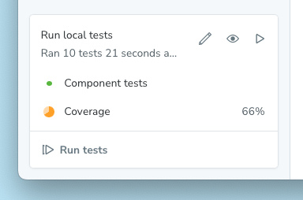
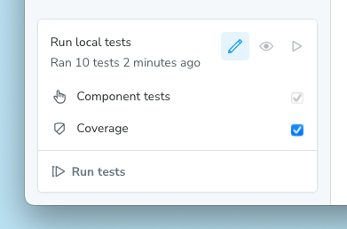
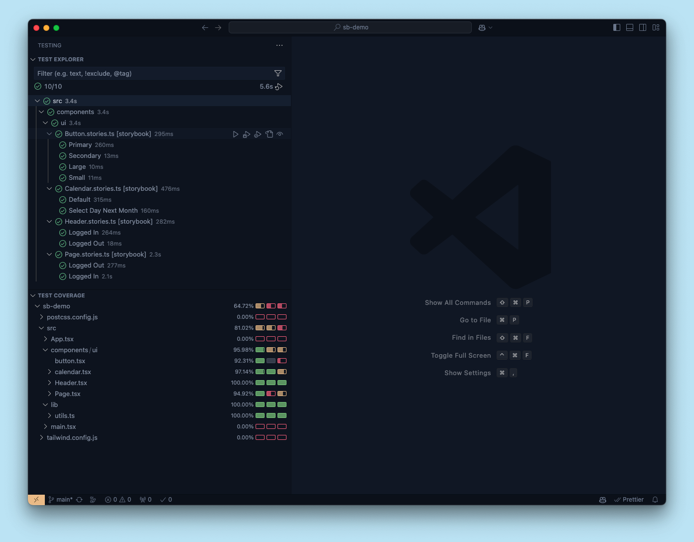

Test coverage is the practice of measuring whether existing tests fully cover your code. That means surfacing areas which aren't currently being tested, such as: conditions, logic branches, functions and variables.

Coverage tests examine the instrumented code against a set of industry-accepted best practices. They act as the last line of QA to improve the quality of your test suite.

<Video src="../_assets/writing-tests/component-test-coverage-whitebg.mp4" />

<If renderer={['react', 'vue', 'svelte']}>

## With Storybook Test

When you run component tests with the [Test addon](./test-addon.mdx), which is powered by [Vitest](https://vitest.dev), it can generate a coverage report. The result is summarized in the testing module, showing the percentage of statements covered by your tested stories.



### Set up

Coverage is included in the Test addon and, when enabled, will be calculated when running component tests for your project. To enable coverage, press the edit button (pencil icon) in the testing module and toggle coverage on:



Before coverage can be calculated, you may be prompted to install a support package corresponding to your [coverage provider](#coverage-provider):


{/* prettier-ignore-start */}

<CodeSnippets path="vitest-plugin-install-coverage-support-packages.md" />

{/* prettier-ignore-end */}

### Usage

Because coverage is built into the Test addon, you can use it everywhere you run your tests.

#### Storybook UI

When you enable coverage in the Storybook UI, the coverage report will be generated and summarized in the testing module after you run your tests. You can see the percentage of statements covered by your tested stories, as well as whether the coverage meets the [watermarks](#watermarks).

Additionally, the full coverage report will be served at the `/coverage/index.html` route of your running Storybook.

<Callout variant="info" icon="⚠️">

It's important to understand that the coverage reported in the Storybook UI has three important limitations:

1. Coverage is calculated using the stories you've written, not the entire codebase. In other words, it will not include any other Vitest tests.
2. Coverage can only be calculated for all stories in your project, not for an individual story or a group of stories.
3. Coverage is not calculated while watch mode is activated. When coverage is enabled, enabling watch mode will disable coverage.

</Callout>

#### CLI

Like the rest of Storybook Test, coverage is built on top of Vitest. Which means you can generate a coverage report using the [Vitest CLI](https://vitest.dev/guide/cli.html).

Assuming you run your tests with a package script like this:

```json title="package.json"
{
  "scripts": {
    "test-storybook": "vitest --project=storybook"
  }
}
```

Then you can generate a coverage report with:

{/* prettier-ignore-start */}

<CodeSnippets path="vitest-plugin-run-with-coverage.md" />

{/* prettier-ignore-end */}

The coverage report will be saved to the [configured coverage reports directory](https://vitest.dev/config/#coverage-reportsdirectory) (`./coverage`, by default) in your project.

<Callout variant="info">

The above command will only calculate coverage for the stories you've written, not the entire codebase.

Because coverage is most accurate when accounting for all tests in your project, you can also run coverage for all tests in your project with:

```sh
npx vitest --coverage
```

</Callout>

#### Editor extension

Coverage is also available through Vitest's [IDE integrations](https://vitest.dev/guide/ide.html). You can calculate and display coverage results directly in your editor.



<Callout variant="info">

Note that this coverage will include _all_ tests in your project, not just the stories you've written.

</Callout>

#### CI

To generate coverage reports in your CI pipeline, you can use the [CLI](#cli).

For example, here's a simplified GitHub Actions workflow that runs your tests and generates a coverage report:

```yaml title=".github/workflows/test-storybook.yml"
name: Storybook Tests
on: push
jobs:
  test:
    steps:
      - uses: actions/checkout@v4
      - uses: actions/setup-node@v4
        with:
          node-version: '20.x'
      - name: Install dependencies
        run: yarn
      - name: Run Storybook tests
        run: yarn test-storybook --coverage
```

For more on testing in CI, see the [Test addon docs](./test-addon.mdx#ci).

### Configuration

#### Coverage provider

You can choose which provider, [v8](https://v8.dev/blog/javascript-code-coverage) (default) or [Istanbul](https://istanbul.js.org/), to use for coverage calculation by setting the `coverage.provider` option in your Vitest config:

```ts title="vitest.config.ts"
import { defineConfig } from 'vitest/config';

export default defineConfig({
  // ...
  test: {
    // ...
    coverage: {
      // ...
      provider: 'istanbul', // 'v8' is the default
    },
  },
});
```

#### Watermarks

Both coverage providers support [watermarks](https://vitest.dev/config/#coverage-watermarks), which are threshold values for coverage. The low watermark is the minimum coverage required to pass the test, and the high watermark is the minimum coverage required to be considered good. A coverage percentage between the low and high watermarks will be considered acceptable but not ideal.

In the testing module, the coverage summary will show the percentage of statements covered by your tested stories, as well as whether the coverage meets the watermarks. Below the low watermark, the icon will be red, between the low and high watermarks, it will be orange, and above the high watermark, it will be green.


To configure the watermarks, you can adjust the Vitest config:

```ts title="vitest.config.ts"
import { defineConfig } from 'vitest/config';

export default defineConfig({
  // ...
  test: {
    // ...
    coverage: {
      // ...
      watermarks: {
        // These are the default values
        statements: [50, 80],
      },
    },
  },
});
```

#### Additional configuration

You can find more configuration options for coverage in the [Vitest documentation](https://vitest.dev/config/#coverage).

When calculating coverage in the Storybook UI, the following options are always ignored:

- `enabled`
- `clean`
- `cleanOnRerun`
- `reportOnFailure`
- `reporter`
- `reportsDirectory`

### Troubleshooting

#### Excluding stories from the coverage report

Until Vitest 2.2.0 is released, the generated coverage report will include the stories files themselves. This is misleading and they should be excluded. To do this, you can add the following to your Vitest config:

```ts title="vitest.config.ts"
import { coverageConfigDefaults, defineConfig } from 'vitest/config';

export default defineConfig({
  // ...
  test: {
    coverage: {
      // 👇 Add this
      exclude: [
         ...coverageConfigDefaults.exclude,
         // This pattern must align with the `stories` property of your `.storybook/main.ts` config
         '**/*.stories.*', '**/*.story.*', '**/stories.*', '**/story.*'
       ], 
    }
  }
})
```

</If>

## With the coverage addon

<YouTubeCallout id="wEa6W8uUGSA" title="These tests use NO CODE | component testing in Storybook" />

Storybook also provides a [coverage addon](https://storybook.js.org/addons/@storybook/addon-coverage). It is powered by [Istanbul](https://istanbul.js.org/), which allows out-of-the-box code instrumentation for the most commonly used frameworks and builders in the JavaScript ecosystem.

### Set up

Engineered to work alongside modern testing tools (e.g., [Playwright](https://playwright.dev/)), the coverage addon automatically instruments your code and generates code coverage data. For an optimal experience, we recommend using the [test runner](./test-runner.mdx) alongside the coverage addon to run your tests.

Run the following command to install the addon.

{/* prettier-ignore-start */}

<CodeSnippets path="storybook-coverage-addon-install.md" />

<Callout variant="info">

The CLI's [`add`](../api/cli-options.mdx#add) command automates the addon's installation and setup. To install it manually, see our [documentation](../addons/install-addons.mdx#manual-installation) on how to install addons.

</Callout>

Start your Storybook with:

{/* prettier-ignore-start */}

<CodeSnippets path="storybook-run-dev.md" />

{/* prettier-ignore-end */}

Finally, open a new terminal window and run the test-runner with:

{/* prettier-ignore-start */}

<CodeSnippets path="test-runner-coverage.md" />

{/* prettier-ignore-end */}


### Configure

By default, the [`@storybook/addon-coverage`](https://storybook.js.org/addons/@storybook/addon-coverage) offers zero-config support for Storybook and instruments your code via [`istanbul-lib-instrument`](https://www.npmjs.com/package/istanbul-lib-instrument) for [Webpack](https://webpack.js.org/), or [`vite-plugin-istanbul`](https://github.com/iFaxity/vite-plugin-istanbul) for [Vite](https://vitejs.dev/). However, you can extend your Storybook configuration file (i.e., `.storybook/main.js|ts`) and provide additional options to the addon. Listed below are the available options divided by builder and examples of how to use them.

{/* prettier-ignore-start */}

<CodeSnippets path="storybook-coverage-addon-config-options.md" />

{/* prettier-ignore-end */}

<details>
<summary>Vite options</summary>

| Options           | Description                                                                                                                                                                                                                                        | Type                        |
| ---------------------- | -------------------------------------------------------------------------------------------------------------------------------------------------------------------------------------------------------------------------------------------------- | --------------------------- |
| `checkProd`            | Configures the plugin to skip instrumentation in production environments<br />`options: { istanbul: { checkProd: true,}}`                                                                                                                           | `boolean`                   |
| `cwd`                  | Configures the working directory for the coverage tests.<br />Defaults to `process.cwd()`<br />`options: { istanbul: { cwd: process.cwd(),}}`                                                                                                        | `string`                    |
| `cypress`              | Replaces the `VITE_COVERAGE` environment variable with `CYPRESS_COVERAGE`.<br />Requires Cypress's [code coverage](https://docs.cypress.io/guides/tooling/code-coverage)<br />`options: { istanbul: { cypress: true,}}`                              | `boolean`                   |
| `exclude`              | Overrides the [default exclude list](https://github.com/storybookjs/addon-coverage/blob/main/src/constants.ts) with the provided list of files or directories to exclude from coverage<br />`options: { istanbul: { exclude: ['**/stories/**'],}}`  | `Array<String>` or `string` |
| `extension`            | Extends the [default extension list](https://github.com/storybookjs/addon-coverage/blob/main/src/constants.ts) with the provided list of file extensions to include in coverage<br />`options: { istanbul: { extension: ['.js', '.cjs', '.mjs'],}}` | `Array<String>` or `string` |
| `forceBuildInstrument` | Configures the plugin to add instrumentation in build mode <br />`options: { istanbul: { forceBuildInstrument: true,}}`                                                                                                                             | `boolean`                   |
| `include`              | Select the files to collect coverage<br />`options: { istanbul: { include: ['**/stories/**'],}}`                                                                                                                                                    | `Array<String>` or `string` |
| `nycrcPath`            | Defines the relative path for the existing nyc [configuration file](https://github.com/istanbuljs/nyc?tab=readme-ov-file#configuration-files)<br />`options: { istanbul: { nycrcPath: '../nyc.config.js',}}`                                        | `string`                    |
| `requireEnv`           | Overrides the `VITE_COVERAGE` environment variable's value by granting access to the `env` variables<br />`options: { istanbul: { requireEnv: true,}}`                                                                                              | `boolean`                   |

</details>

<details>
<summary>Webpack 5 options</summary>

| Options      | Description                                                                                                                                                                                                                                        | Type                        |
| ---------------------- | -------------------------------------------------------------------------------------------------------------------------------------------------------------------------------------------------------------------------------------------------- | --------------------------- |
| `autoWrap`             | Provides support for top-level return statements by wrapping the program code in a function<br />`options: { istanbul: { autoWrap: true,}}`                                                                                                         | `boolean`                   |
| `compact`              | Condenses the output of the instrumented code. Useful for debugging<br />`options: { istanbul: { compact: false,}}`                                                                                                                                 | `boolean`                   |
| `coverageVariable`     | Defines the global variable name that Istanbul will use to store coverage results<br />`options: { istanbul: { coverageVariable: '__coverage__',}}`                                                                                                 | `string`                    |
| `cwd`                  | Configures the working directory for the coverage tests.<br />Defaults to `process.cwd()`<br />`options: { istanbul: { cwd: process.cwd(),}}`                                                                                                        | `string`                    |
| `debug`                | Enables the debug mode for additional logging information during the instrumentation process<br />`options: { istanbul: { debug: true,}}`                                                                                                           | `boolean`                   |
| `esModules`            | Enables support for ES Module syntax<br />`options: { istanbul: { esModules: true,}}`                                                                                                                                                               | `boolean`                   |
| `exclude`              | Overrides the [default exclude list](https://github.com/storybookjs/addon-coverage/blob/main/src/constants.ts) with the provided list of files or directories to exclude from coverage<br />`options: { istanbul: { exclude: ['**/stories/**'],}}`  | `Array<String>` or `string` |
| `extension`            | Extends the [default extension list](https://github.com/storybookjs/addon-coverage/blob/main/src/constants.ts) with the provided list of file extensions to include in coverage<br />`options: { istanbul: { extension: ['.js', '.cjs', '.mjs'],}}` | `Array<String>` or `string` |
| `include`              | Select the files to collect coverage<br />`options: { istanbul: { include: ['**/stories/**'],}}`                                                                                                                                                    | `Array<String>` or `string` |
| `nycrcPath`            | Defines the relative path for the existing nyc [configuration file](https://github.com/istanbuljs/nyc?tab=readme-ov-file#configuration-files)<br />`options: { istanbul: { nycrcPath: '../nyc.config.js',}}`                                        | `string`                    |
| `preserveComments`     | Includes comments in the instrumented code<br />`options: { istanbul: { preserveComments: true,}}`                                                                                                                                                  | `boolean`                   |
| `produceSourceMap`     | Configures Instanbul to generate a source map for the instrumented code<br />`options: { istanbul: { produceSourceMap: true,}}`                                                                                                                     | `boolean`                   |
| `sourceMapUrlCallback` | Defines a callback function invoked with the filename and the source map URL when a source map is generated<br />`options: { istanbul: { sourceMapUrlCallback: (filename, url) => {},}}`                                                            | `function`                  |

</details>

### What about other coverage reporting tools?

Out of the box, code coverage tests work seamlessly with Storybook's test-runner and the [`@storybook/addon-coverage`](https://storybook.js.org/addons/@storybook/addon-coverage). However, that doesn't mean you can't use additional reporting tools (e.g., [Codecov](https://about.codecov.io/)). For instance, if you're working with [LCOV](https://wiki.documentfoundation.org/Development/Lcov), you can use the generated output (in `coverage/storybook/coverage-storybook.json`) and create your own report with:

{/* prettier-ignore-start */}

<CodeSnippets path="storybook-coverage-report-lcov.md" />

{/* prettier-ignore-end */}

***

### Troubleshooting

#### Run test coverage in other frameworks

If you intend on running coverage tests in frameworks with special files like Vue 3 or Svelte, you'll need to adjust your configuration and enable the required file extensions. For example, if you're using Vue, you'll need to add the following to your nyc configuration file (i.e., `.nycrc.json` or `nyc.config.js`):

{/* prettier-ignore-start */}

<CodeSnippets path="storybook-coverage-report-vue.md" />

{/* prettier-ignore-end */}

#### The coverage addon doesn't support optimized builds

If you generated a production build optimized for performance with the [`--test`](../sharing/publish-storybook.mdx#customizing-the-build-for-performance) flag, and you're using the coverage addon to run tests against your Storybook, you may run into a situation where the coverage addon doesn't instrument your code. This is due to how the flag works, as it removes addons that have an impact on performance (e.g., [`Docs`](../writing-docs/index.mdx), [coverage addon](https://storybook.js.org/addons/@storybook/addon-coverage)). To resolve this issue, you'll need to adjust your Storybook configuration file (i.e., `.storybook/main.js|ts`) and include the [`disabledAddons`](../api/main-config/main-config-build.mdx#testdisabledaddons) option to allow the addon to run tests at the expense of a slower build.

{/* prettier-ignore-start */}

<CodeSnippets path="storybook-coverage-addon-optimized-config.md" />

{/* prettier-ignore-end */}

#### The coverage addon doesn't support instrumented code

As the [coverage addon](https://storybook.js.org/addons/@storybook/addon-coverage) is based on Webpack5 loaders and Vite plugins for code instrumentation, frameworks that don't rely upon these libraries (e.g., Angular configured with Webpack), will require additional configuration to enable code instrumentation. In that case, you can refer to the following [repository](https://github.com/yannbf/storybook-coverage-recipes) for more information.

**Learn about other UI tests**

* [Component tests](./component-testing.mdx) for user behavior simulation
* [Visual tests](./visual-testing.mdx) for appearance
* [Accessibility tests](./accessibility-testing.mdx) for accessibility
* [Snapshot tests](./snapshot-testing/snapshot-testing.mdx) for rendering errors and warnings
* [Test runner](./test-runner.mdx) to automate test execution
* Test coverage for measuring code coverage
* [End-to-end tests](./import-stories-in-tests/stories-in-end-to-end-tests.mdx) for simulating real user scenarios
* [Unit tests](./import-stories-in-tests/stories-in-unit-tests.mdx) for functionality